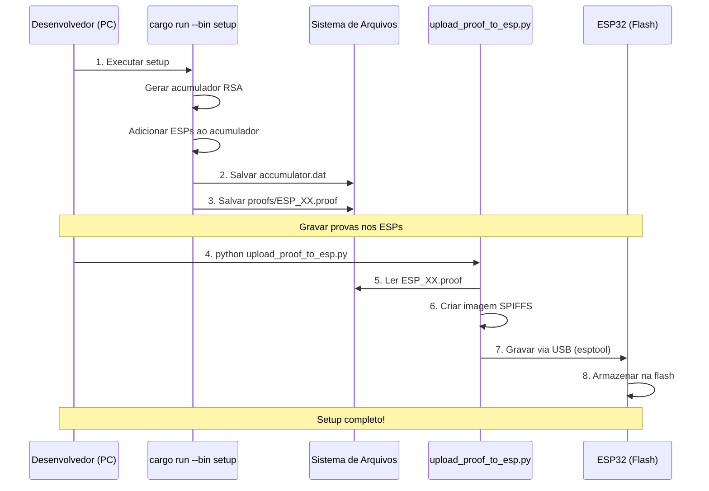
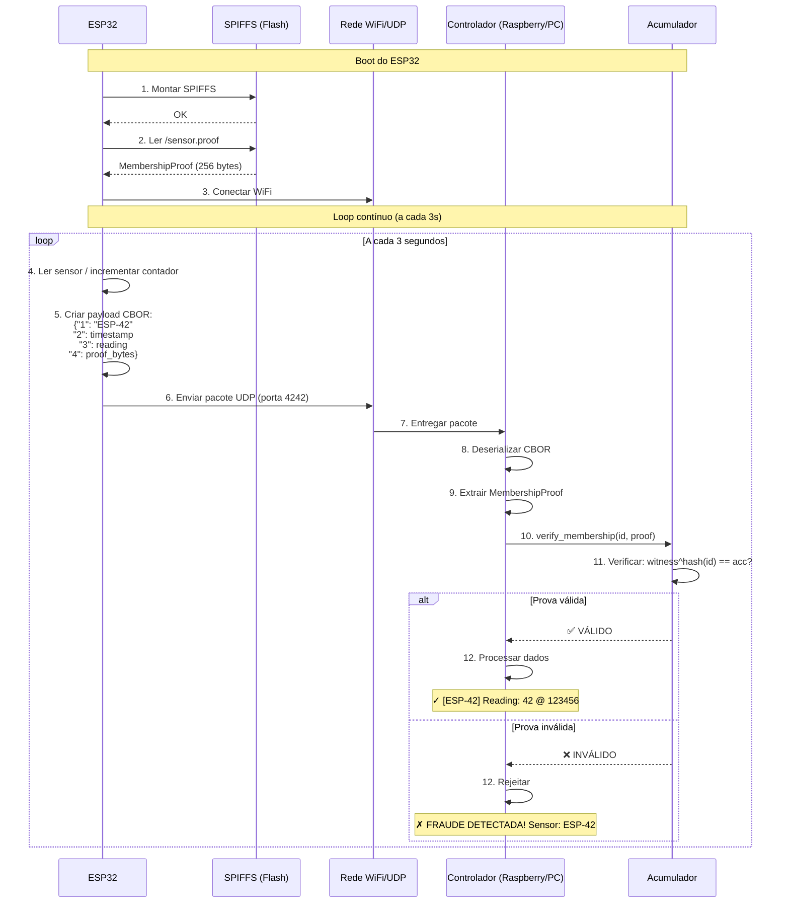
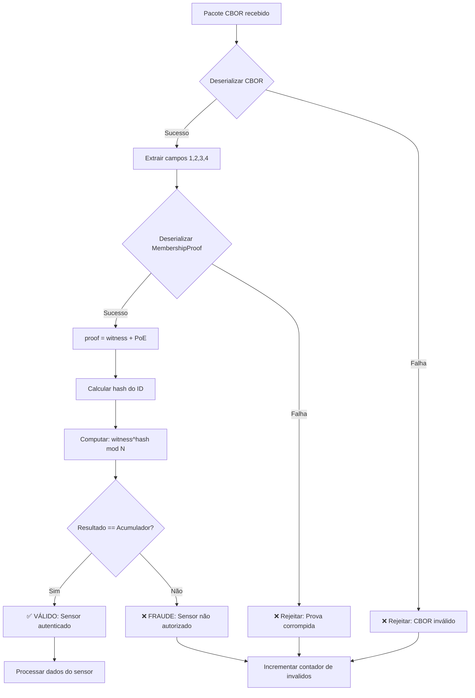
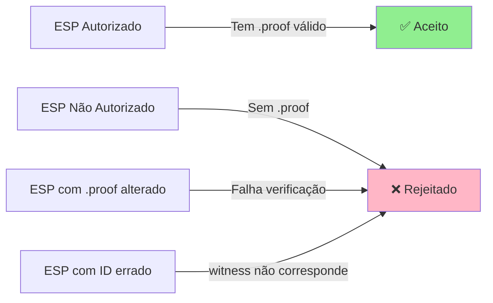

# Fluxo Completo: ESP32 → Controlador

Diagrama visual do processo completo de configuração e operação do sistema.

---

## 1️⃣ FASE DE SETUP (Uma vez apenas)



---

## 2️⃣ FASE DE OPERAÇÃO (Contínuo)



---

## 3️⃣ ESTRUTURA DE DADOS

### Acumulador (accumulator.dat)

```
┌─────────────────────────────────┐
│  Acumulador RSA (Rsa2048)       │
├─────────────────────────────────┤
│  value: RSA Element             │
│  (representa todos os ESPs)     │
│                                 │
│  ESP-01 ──┐                     │
│  ESP-02 ──┼─→ Acumulado em      │
│  ESP-42 ──┘   um único valor    │
└─────────────────────────────────┘
      ↓
Usado pelo Controlador para verificar
```

### MembershipProof (ESP_XX.proof)

```
┌─────────────────────────────────┐
│  MembershipProof para ESP-42    │
├─────────────────────────────────┤
│  witness: RSA Element           │
│  (prova que ESP-42 pertence)    │
│                                 │
│  poe: PoE                       │
│  (proof of exponentiation)      │
└─────────────────────────────────┘
      ↓
Gravado na flash do ESP-42
```

### Pacote CBOR (enviado pelo ESP)

```
┌─────────────────────────────────┐
│  Mapa CBOR (4 campos)           │
├─────────────────────────────────┤
│  "1": "ESP-42"          (String)│
│  "2": 123456            (u64)   │
│  "3": 42                (u64)   │
│  "4": [0xA2, 0x01...]   (Bytes) │
│       └─ MembershipProof        │
└─────────────────────────────────┘
      ↓
Enviado via UDP porta 4242
```

---

## 4️⃣ VERIFICAÇÃO CRIPTOGRÁFICA



**Equação matemática:**
```
witness^hash(id) ≡ accumulator (mod N)

Onde:
  - witness: Elemento da prova
  - hash(id): Hash criptográfico do ID do sensor
  - accumulator: Valor do acumulador com todos os ESPs
  - N: Módulo RSA (2048 bits)
```

---

## 5️⃣ CHECKLIST DE IMPLEMENTAÇÃO

### Setup Inicial
- [ ] 1. Definir lista de ESPs autorizados em `setup.rs`
- [ ] 2. Executar `cargo run --bin setup`
- [ ] 3. Verificar que `accumulator.dat` foi criado
- [ ] 4. Verificar que arquivos `proofs/*.proof` existem

### Configuração do ESP32
- [ ] 5. Conectar ESP32 via USB
- [ ] 6. Identificar porta COM (Device Manager no Windows)
- [ ] 7. Instalar dependências Python: `pip install esptool mkspiffs-prebuilt`
- [ ] 8. Executar script de upload: `python upload_proof_to_esp.py --port COMX --esp-id ESP-XX`
- [ ] 9. Verificar log: "✅ Prova gravada com sucesso"

### Programação do ESP32
- [ ] 10. Abrir `esp32_sensor/esp32_sensor.ino`
- [ ] 11. Instalar biblioteca TinyCBOR
- [ ] 12. Configurar WiFi, IP do servidor e SENSOR_ID
- [ ] 13. Compilar e fazer upload do código
- [ ] 14. Abrir Serial Monitor (115200 baud)
- [ ] 15. Verificar: "✅ Inicialização completa!"

### Execução do Controlador
- [ ] 16. Copiar `accumulator.dat` para pasta do controlador
- [ ] 17. Executar: `cargo run --release` (no SnifferESP)
- [ ] 18. Verificar: "✓ Acumulador carregado com sucesso"
- [ ] 19. Aguardar pacotes do ESP

### Validação
- [ ] 20. Verificar logs do ESP: "✅ Pacote enviado"
- [ ] 21. Verificar logs do Controlador: "✓ [ESP-XX] Reading: ..."
- [ ] 22. Verificar estatísticas a cada 10 segundos
- [ ] 23. Testar com ESP não autorizado (deve falhar)

---

## 6️⃣ ARQUIVOS E LOCALIZAÇÃO

```
c:\GSIPP\ImplementacaoAC\
│
├── SnifferESP/
│   ├── src/
│   │   ├── main.rs                    # Controlador (recebe e verifica)
│   │   └── setup.rs                   # Gera acumulador e provas
│   │
│   ├── accumulator.dat                # ← Gerado pelo setup
│   ├── proofs/                        # ← Gerado pelo setup
│   │   ├── ESP_01.proof
│   │   ├── ESP_02.proof
│   │   └── ESP_42.proof
│   │
│   ├── upload_proof_to_esp.py         # Script para gravar no ESP
│   ├── ESP32_SETUP_GUIDE.md           # Guia completo
│   │
│   └── esp32_sensor/
│       ├── esp32_sensor.ino           # Código do ESP32
│       ├── platformio.ini             # Config PlatformIO
│       └── README.md                  # Instruções ESP32
│
└── interfaceCBOR/
    └── test.rs                        # Teste de integração CBOR
```

---

## 7️⃣ FLUXO DE DADOS DETALHADO

### No ESP32:

```cpp
// 1. Ler sensor
uint64_t reading = analogRead(A0);

// 2. Criar CBOR
CborEncoder encoder;
cbor_encoder_create_map(&encoder, &map, 4);
cbor_encode_text_stringz(&map, "1");
cbor_encode_text_stringz(&map, "ESP-42");
cbor_encode_text_stringz(&map, "2");
cbor_encode_uint(&map, timestamp);
cbor_encode_text_stringz(&map, "3");
cbor_encode_uint(&map, reading);
cbor_encode_text_stringz(&map, "4");
cbor_encode_byte_string(&map, proofBytes, proofSize);

// 3. Enviar UDP
udp.beginPacket(serverIP, 4242);
udp.write(cborBuffer, cborLength);
udp.endPacket();
```

### No Controlador (Rust):

```rust
// 1. Receber UDP
let (size, source) = socket.recv_from(&mut buf)?;

// 2. Deserializar CBOR → Payload
let payload: Payload = serde_cbor::from_slice(&buf[..size])?;

// 3. Deserializar MembershipProof
let proof: MembershipProof = serde_cbor::from_slice(&payload.membership_proof)?;

// 4. Verificar
if acc.verify_membership(&payload.id, &proof) {
    println!("✓ Sensor {} autenticado", payload.id);
} else {
    println!("✗ FRAUDE detectada!");
}
```

---

## 8️⃣ SEGURANÇA DO SISTEMA



### Proteções:

1. **Autenticação criptográfica**: Apenas ESPs com `.proof` válido são aceitos
2. **Integridade**: Qualquer alteração na prova é detectada
3. **Não-repúdio**: Cada ESP tem identificação única
4. **Eficiência**: Verificação rápida (~1-2 ms)

---

Este documento fornece uma visão completa do sistema! 🚀
